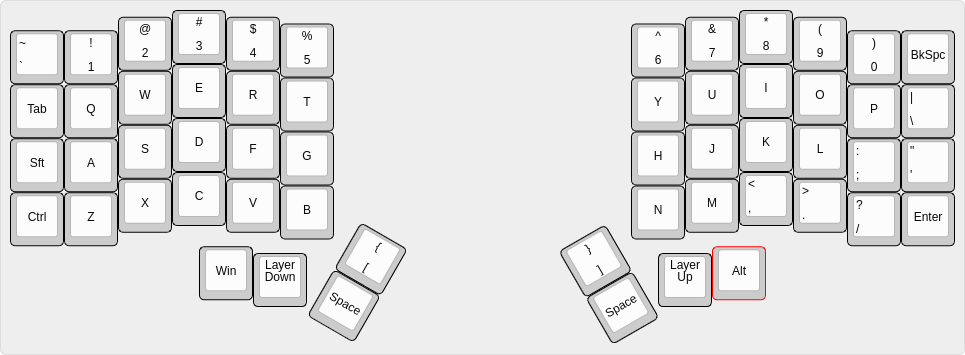

# Keebio Iris Rev 8 Keymap

## Features
- Designed for rev 8 model
- Per-layer RGB lighting settings
- Tap dance keys
- Automation/macros inspired based on BadUSB scripts

## Layers

- "Layer up" cycles up through layers
- "Layer down" cycles down through layers

### Qwerty

#### Special functions
- Hold left brace for temporary Fn layer 
- Hold right brace for temporary mouse layer
- Double tap '~ `' for Esc
- Double tap left shift for caps lock
- Double tap left ctrl for right ctrl
- Double tap left win for right win
- Double tap right alt for left alt

### Fn
### SYMBOLS
### Navigation
### Mouse
### Media
### Gaming

## Ducky Scripts

## Usage

1) Ensure you have Podman installed
2) Execute ./build.sh
3) Resulting UF2 firmware file will be copied to ./build-volume/build-output/
