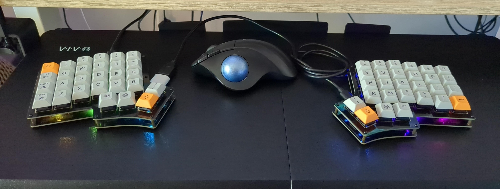

# Keebio Iris Rev 8 Keymap

## Features
- Designed for rev 8 model
- Per-layer RGB lighting settings
- Tap dance keys
- Compiling is easy thanks to podman and build.sh

## Layers

- "Layer up" cycles up through layers
- "Layer down" cycles down through layers

### Qwerty (Layer 0)

.png "Qwerty Layer")

#### Special functions
- Hold left brace for temporary Fn layer 
- Hold right brace for temporary mouse layer
- Double tap '~ `' for Esc
- Double tap left shift for caps lock
- Double tap left ctrl for right ctrl
- Double tap left win for right win
- Double tap right alt for left alt

### Fn (Layer 1)

.png "Fn Layer")

- Can be switched to temporarily by holding left brace in the qwerty layer

### SYMBOLS (Layer 2)

.png "Symbol Layer")

### Navigation (Layer 3)

.png "Navigation Layer")

### Mouse (Layer 4)

.png "Mouse Layer")

- Can be switched to temporarily by holding right brace in the qwerty layer

### Media (Layer 5)

.png "Media Layer")

### Gaming (Layer 6)

.png "Gaming Layer")

## How to use

1) Ensure you have Podman installed.
2) Execute ./build.sh
3) Resulting UF2 firmware file will be copied to ./build-volume/build-output/
4) Double press the reset button under each keyboard half.
5) Each keyboard half should expose its filesystem to your computer.
6) Mount both keyboard filesystems and drag and drop the UF2 file to each.
7) You have successfully flashed the keyboard with this configuration!
